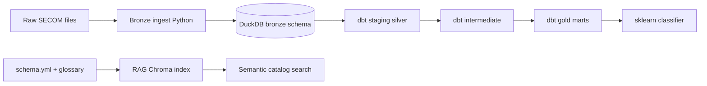

# ChipYield Data Universe

Semiconductor yield analytics pipeline using **dbt**, **DuckDB**, and the public [UCI SECOM](https://archive.ics.uci.edu/dataset/179/secom) manufacturing dataset.

The project implements a medallion-style data platform: bronze ingest, SQL transforms with dbt, tested gold marts for analytics and ML, plus semantic search over the data catalog.

## Features

- **Medallion architecture** — bronze → silver (staging/intermediate) → gold (marts)
- **dbt Core** — models, tests, documentation, and macros
- **19 data quality tests** — uniqueness, null checks, accepted values
- **AI-ready gold mart** — `mart_ml_features` for downstream ML
- **Yield analytics marts** — daily and summary KPI tables
- **Catalog RAG** — embedding-based search over model docs and glossary

## Architecture



| Layer | Objects | Purpose |
|-------|---------|---------|
| Bronze | `bronze.secom_*` | Raw ingest, audit/replay |
| Silver | `staging.*`, `intermediate.*` | Clean, impute, feature engineering |
| Gold | `marts.mart_*` | Curated analytics and ML datasets |

| Gold table | Grain | Use case |
|------------|-------|----------|
| `mart_yield_analytics` | one row / test_date | Daily yield trends |
| `mart_yield_summary` | single-row KPIs | Overall yield summary |
| `mart_ml_features` | one row / wafer | ML training and inference |

## Quick start

Requires **Python 3.12** (dbt is not compatible with 3.14).

```bash
git clone https://github.com/Sree-Nandhan/chipyield-data-universe.git
cd chipyield-data-universe
python3.12 -m venv .venv
source .venv/bin/activate
pip install -r requirements.txt
bash scripts/run_pipeline.sh
```

### Run steps individually

```bash
python scripts/01_ingest_bronze.py
dbt run --profiles-dir .
dbt test --profiles-dir .
python scripts/03_train_classifier.py
python scripts/04_rag_catalog.py --build
python scripts/05_ask_catalog.py
```

## Project layout

```
models/
├── staging/          # Clean raw readings and labels
├── intermediate/     # Sensor selection, imputation, features
└── marts/            # Gold tables for BI and ML
scripts/
├── 01_ingest_bronze.py
├── 03_train_classifier.py
├── 04_rag_catalog.py
└── run_pipeline.sh
docs/
└── data_catalog_glossary.md
```

## ML pipeline

`scripts/03_train_classifier.py` trains a RandomForest on **`marts.mart_ml_features` only** (not raw bronze data).

Example metrics from `artifacts/model_metrics.json`:

- 1,567 wafers, 50 engineered features
- Class-balanced RandomForest on binary pass/fail target (`is_fail`)

## Data catalog search

The RAG layer indexes dbt model documentation and the business glossary so users can query the catalog in natural language:

```bash
python scripts/04_rag_catalog.py --query "what is the ML training table"
python scripts/05_ask_catalog.py
```

## Production port (Databricks / AWS)

| Local | Cloud lakehouse |
|-------|-----------------|
| DuckDB | S3 + Delta Lake |
| dbt-duckdb | dbt-databricks |
| Python bronze ingest | Auto Loader / notebook job |
| Chroma RAG | Managed vector search |
| schema.yml | Unity Catalog metadata |

## Data source

If raw files are missing from `data/bronze/`:

```bash
curl -L -o data/bronze/secom.data \
  https://archive.ics.uci.edu/ml/machine-learning-databases/secom/secom.data
curl -L -o data/bronze/secom_labels.data \
  https://archive.ics.uci.edu/ml/machine-learning-databases/secom/secom_labels.data
```

## License

MIT (personal portfolio project)

## Author

Sree Nandhan Prabhakar — [GitHub](https://github.com/Sree-Nandhan)
